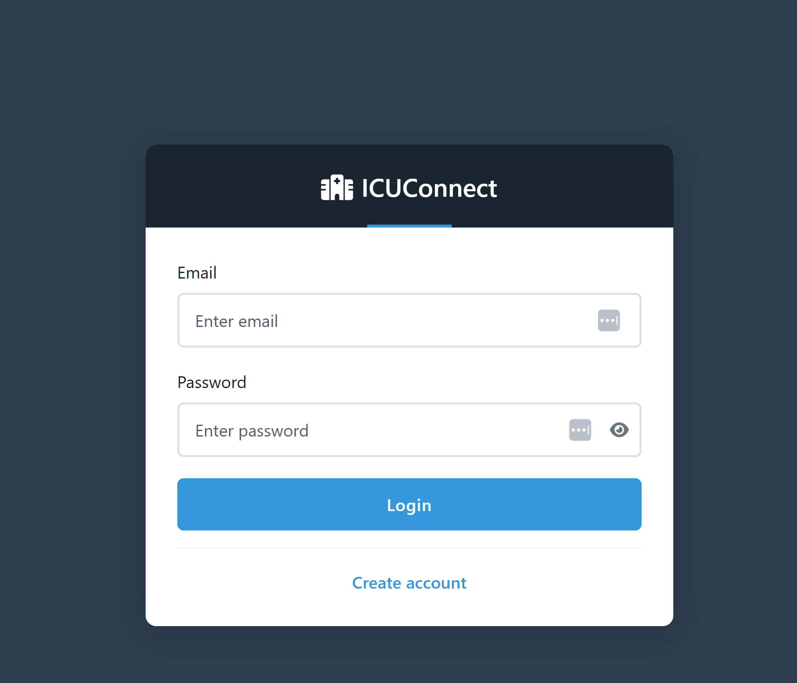
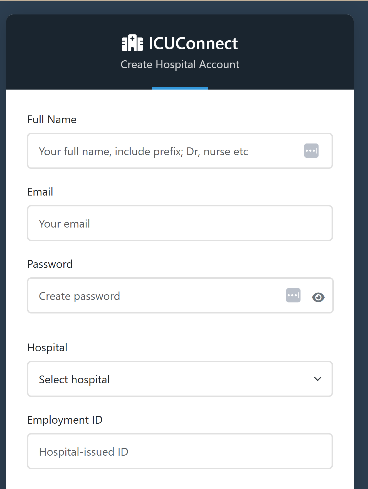
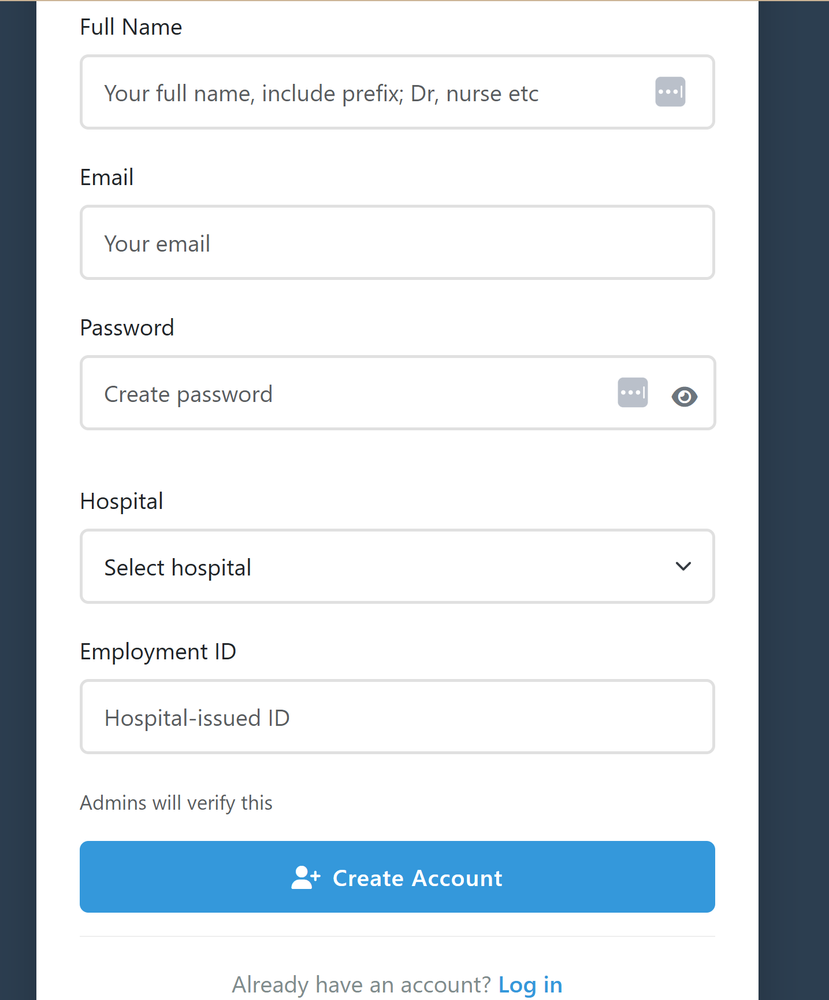
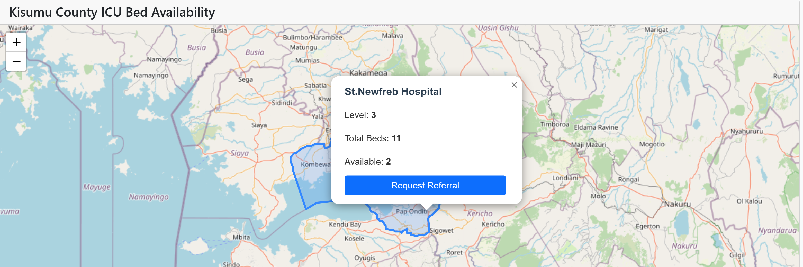
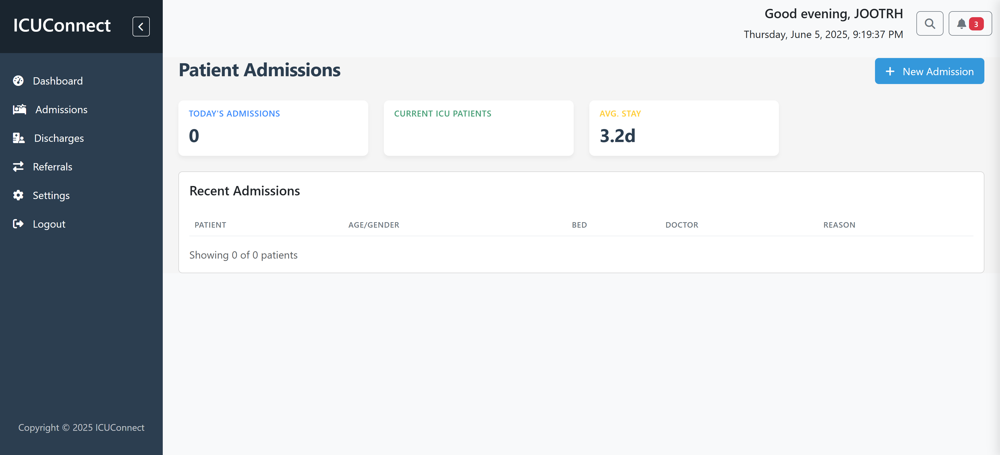
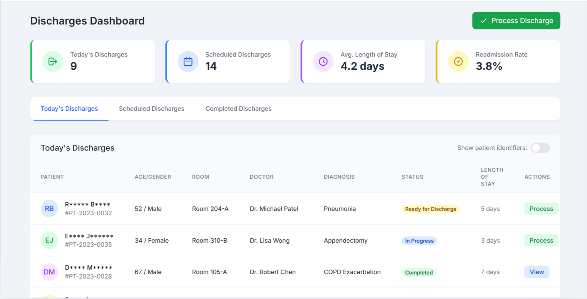

# ICUConnect

## 📌 Description

**ICUConnect** is a Flask-based web dashboard designed to coordinate ICU bed availability across public hospitals in Kenya. It integrates machine learning to predict ICU occupancy and facilitates hospital-to-hospital referrals, enhancing real-time visibility into ICU resources.

---

## 🔗 GitHub Repository

[https://github.com/k-ganda/ICUConnect](https://github.com/k-ganda/ICUConnect)

---

## ⚙️ Project Setup

## Steps to Run The App

1. **📁 Clone the Repository**

```
git clone https://github.com/k-ganda/ICUConnect.git
cd ICUConnect
```

2. **Create a Virtual Environment**

```
python -m venv venv
source venv/bin/activate # On Windows: venv\Scripts\activate
```

3. **Install the Dependencies**

```
pip install -r requirements.txt
```

4. **Run the Flask App**

```
python run.py
```

Open your browser and go to : http://127.0.0.1:5000/ .

**NOTE:**

You will be able to sign up, but login is restricted to verified users only due to ethical considerations around sensitive hospital data.

### Model Notebook

he machine learning model notebook can be found in

```
notebook/Predict_Occupancy_fixed.ipynb
```

It includes:

- Exploratory Data Analysis (EDA)

- Feature Engineering

- A baseline ARIMA model to forecast ICU occupancy

- Evaluation metrics including RMSE, MSE, MAE, and R² score

The dataset used is publicly available from the Ontario Open Data portal:

```
https://data.ontario.ca/dataset/availability-of-adult-icu-beds-and-occupancy-for-covid-related-critical-illness-crci/resource/c7f2590f-362a-498f-a06c-da127ec41a33
```

## Web Dashbaord Screenshots

### Login Page



### Sign UP




### Dashboard




### Admission




### Discharge



## Deployment Plan

### Phase 1- MVP(local Deployment)

- Run the Flask app locally

- Use SQLite as local database

- Manual updates of ICU bed records.

### Phase 2 - Cloud Deployment(Planned)

- Host on Render or similar cloud platform

- Use PostgreSQl for database management

- Deploy and integrate trained ML model

- Secure access and user role management

## Demo Video

## Tools & Technologies

Flask – Backend web framework

Pandas, Matplotlib, Scikit-learn – data analysis & modeling

SQLite / SQLAlchemy – lightweight database(currently)

Bootstrap / HTML / CSS – frontend UI

Jupyter Notebook – ML Model Development

## Author

Kathrine Ganda
k.ganda@alustudent.com
Final Year Capstone Project - African Leadership University
