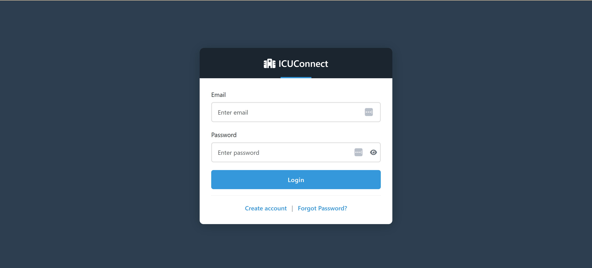
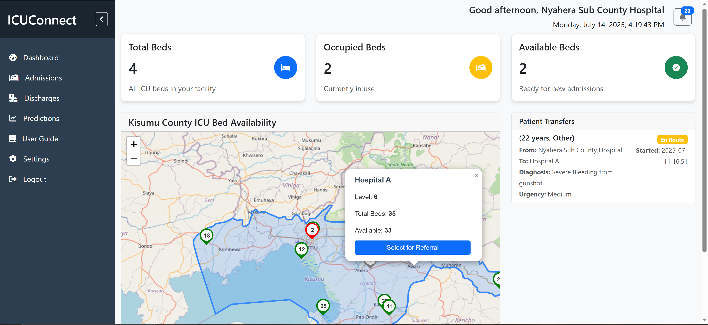
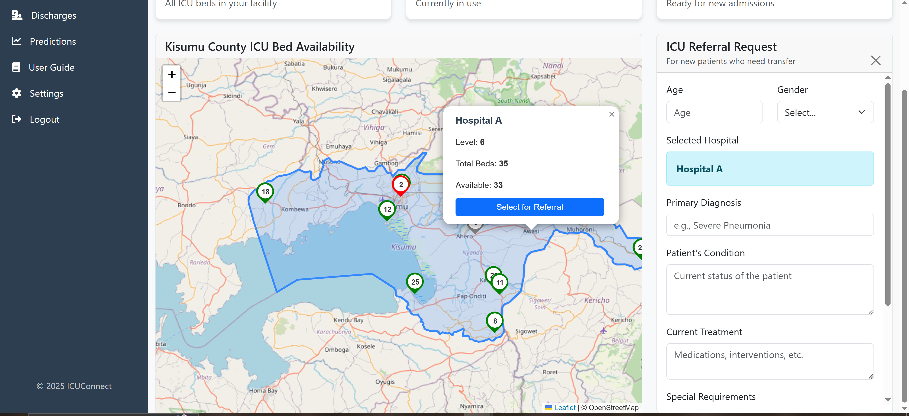
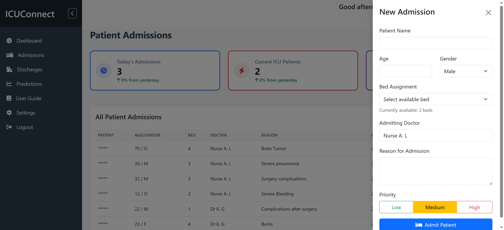
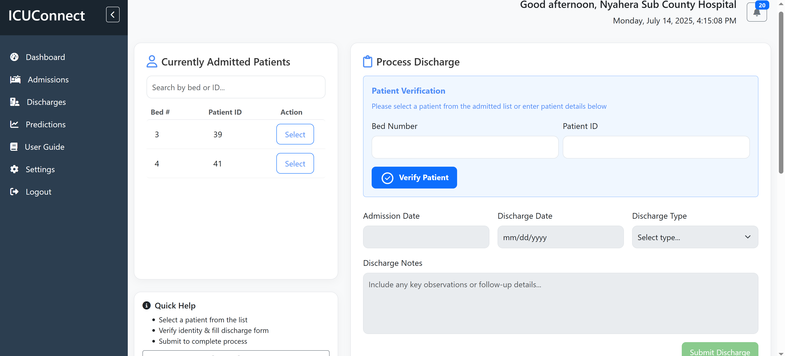
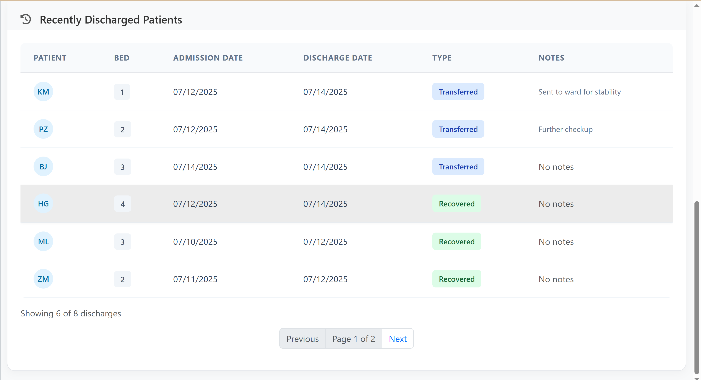
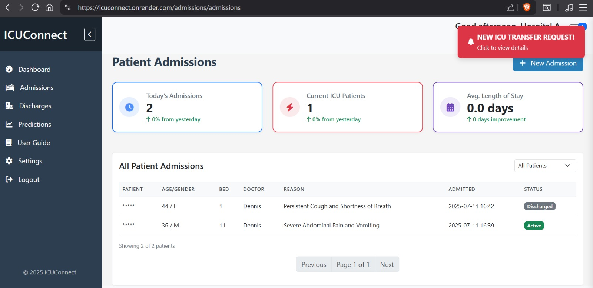
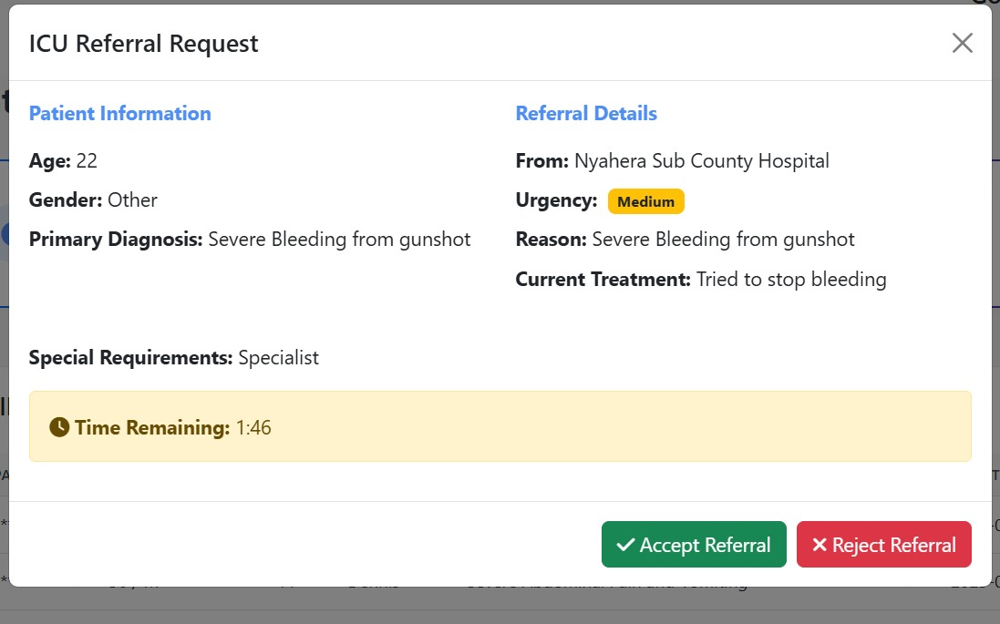
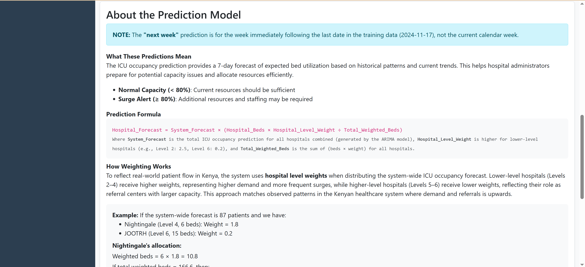
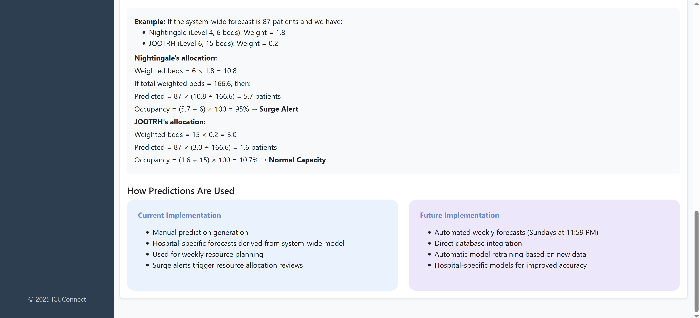

# ICUConnect

---

## 1. Project Overview

ICUConnect is a Flask-based web dashboard for coordinating ICU bed availability across public hospitals in Kenya. It integrates machine learning to predict ICU occupancy and facilitates hospital-to-hospital referrals, enhancing real-time visibility into ICU resources.

---

## 2. Table of Contents

1. [Project Overview](#1-project-overview)
2. [Demo Video](#3-demo-video)
3. [Deployed Version](#4-deployed-version)
4. [Directory Structure](#5-directory-structure)
5. [Installation & Running the App](#6-installation--running-the-app)
6. [Core Features](#7-core-features)
7. [Screenshots](#8-screenshots)
8. [Testing](#9-testing)
9. [Related Files](#10-related-files)
10. [Tools & Technologies](#11-tools--technologies)
11. [Author](#12-author)
12. [Deployment Plan](#13-deployment-plan)

---

## 3. Demo Video

- https://youtu.be/MuZ4L4AzKDA

---

## 4. Deployed Version

- **Live App:**

https://icuconnect.onrender.com

---

## 5. Directory Structure

```
ICUConnect/
├── app/
│   ├── __init__.py              # Application factory
│   ├── models.py                # Database models
│   ├── utils.py                 # Utility functions
│   ├── routes/                  # Route handlers
│   │   ├── auth.py             # Authentication routes
│   │   ├── admin.py            # Admin dashboard routes
│   │   ├── user_routes.py      # User dashboard routes
│   │   ├── admission_routes.py # Patient admission routes
│   │   ├── discharge_routes.py # Patient discharge routes
│   │   ├── referral_routes.py  # Referral management routes
│   │   ├── transfer_routes.py  # Patient transfer routes
│   │   └── prediction_routes.py # ML prediction routes
│   ├── templates/              # HTML templates
│   ├── static/                 # Static assets (CSS, JS, images)
│   └── Dataset/                # Training data for ML model
├── models/                     # Trained ML models
├── migrations/                 # Database migrations
├── tests/                      # Test suite (see [Testing](#9-testing))
├── deployment/                 # Deployment configuration
├── run.py                      # Application entry point
└── README.md                   # Project documentation
```

---

## 6. Installation & Running the App

### Step 1: Clone the Repository

```bash
git clone https://github.com/k-ganda/ICUConnect.git
cd ICUConnect
```

### Step 2: Create a Virtual Environment

```bash
python -m venv venv
# On Linux/Mac:
source venv/bin/activate
# On Windows:
venv\Scripts\activate
```

### Step 3: Install Dependencies

```bash
pip install -r requirements.txt
```

### Step 4: Run the Flask App

```bash
python run.py
```

- Open your browser and go to: [http://127.0.0.1:5000/](http://127.0.0.1:5000/)

> **Note:**  
> You can sign up, but login is restricted to verified users only due to ethical considerations around sensitive hospital data.

---

## 7. Core Features

- **ICU Dashboard:** Real-time view of ICU bed availability across hospitals.
- **Referrals:** Initiate and manage patient referrals between hospitals.
- **Transfers:** Track and manage patient transfers.
- **Admissions & Discharges:** Admit and discharge patients, with full audit trail.
- **Predictions:** Machine learning-based ICU occupancy forecasting.
- **Role-based Access:** Admin, and hospital personnel dashboards.
- **Notifications:** Real-time updates and escalation for urgent cases.
- **Real-Time Updates:** Bed changes, admissions, discharges, referrals are instant

---

## 8. Screenshots

- **Authentication**
  
- **Dashboard:**  
  
  

- **Admissions:**  
  

- **Discharge:**  
  
  

- **Referrals**
  
  

- **Predictions**
  
  
  

- **Settings**
  

---

## 9. Testing

- **Test Suite:**  
  Comprehensive unit, integration, and functional tests are provided.

- **How to Run Tests:**  
  See the [tests/README.md](tests/README.md) for detailed instructions, test descriptions, and analysis.

---

## 10. Related Files

- **Machine Learning Model Notebook:**  
  `notebook/Predict_Occupancy_fixed.ipynb`  
  Includes EDA, feature engineering, ARIMA modeling, and evaluation metrics.

- **Dataset:**  
  Publicly available from the [Ontario Open Data portal](https://data.ontario.ca/dataset/availability-of-adult-icu-beds-and-occupancy-for-covid-related-critical-illness-crci/resource/c7f2590f-362a-498f-a06c-da127ec41a33).

- **Deployment Configuration:**  
  See `deployment/` for Render and production setup.

---

## 11. Tools & Technologies

- **Backend:** Flask, Flask-SocketIO, SQLAlchemy, Flask-Login, Flask-Mail
- **Frontend:** Bootstrap, HTML, CSS, JavaScript
- **ML/Analysis:** Pandas, Scikit-learn, Statsmodels, Jupyter Notebook
- **Database:** SQLite (local), PostgreSQL (cloud)
- **Testing:** Pytest, Selenium (for functional tests)
- **Other:** Gunicorn, Eventlet, Render (for deployment)

---

## 12. Author

Kathrine Ganda  
k.ganda@alustudent.com  
Final Year Capstone Project - African Leadership University

---
