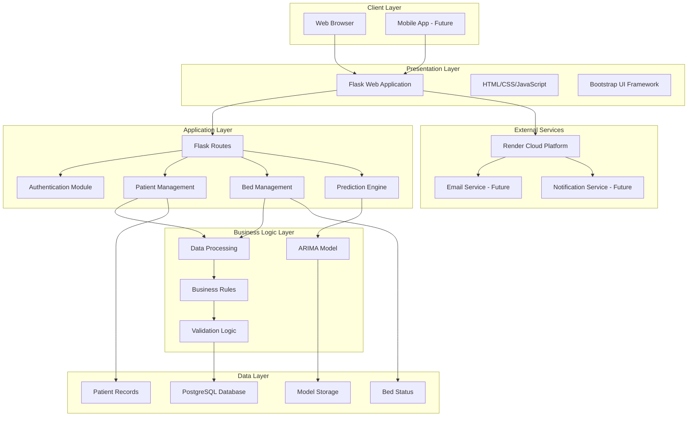
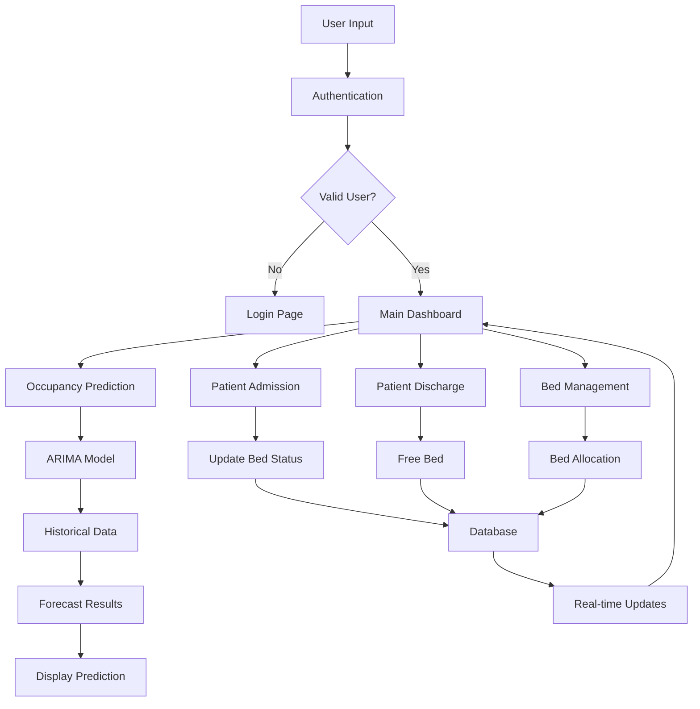
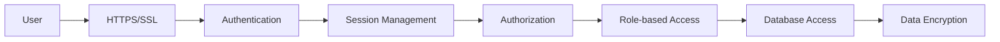
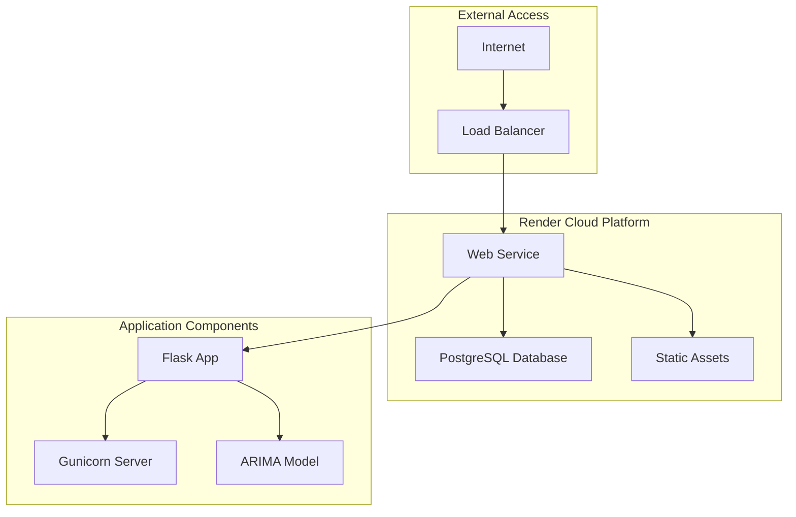

# ICU Occupancy Prediction System - System Architecture

## 1. High-Level System Architecture

## 2. System Components Overview

### 2.1 Client Layer

- **Web Browser**: Primary interface for hospital staff
- **Mobile App**: Future enhancement for mobile access

### 2.2 Presentation Layer

- **Flask Web Application**: Main web framework
- **HTML/CSS/JavaScript**: Frontend technologies
- **Bootstrap**: UI framework for responsive design

### 2.3 Application Layer

- **Flask Routes**: API endpoints and page routing
- **Authentication Module**: User login and session management
- **Patient Management**: Admission and discharge operations
- **Bed Management**: Bed allocation and status tracking
- **Prediction Engine**: ARIMA model integration

### 2.4 Business Logic Layer

- **ARIMA Model**: Time series forecasting for bed occupancy
- **Data Processing**: Patient data aggregation and preprocessing
- **Business Rules**: Hospital-specific logic and constraints
- **Validation Logic**: Input validation and data integrity

### 2.5 Data Layer

- **PostgreSQL Database**: Primary data storage
- **Model Storage**: Saved ARIMA model files
- **Patient Records**: Admission and discharge history
- **Bed Status**: Real-time bed availability

### 2.6 External Services

- **Render Cloud Platform**: Hosting and deployment
- **Email Service**: Future notification system
- **Notification Service**: Future alert system

## 3. Technology Stack

| Layer           | Technology              | Purpose                    |
| --------------- | ----------------------- | -------------------------- |
| Frontend        | HTML5, CSS3, JavaScript | User interface             |
| UI Framework    | Bootstrap 5             | Responsive design          |
| Backend         | Python 3.11             | Server-side logic          |
| Web Framework   | Flask 3.0.3             | Web application framework  |
| Database        | PostgreSQL              | Data persistence           |
| ORM             | SQLAlchemy              | Database abstraction       |
| Authentication  | Flask-Login             | User session management    |
| ML Framework    | StatsModels             | ARIMA model implementation |
| Data Processing | Pandas, NumPy           | Data manipulation          |
| Deployment      | Render                  | Cloud hosting              |
| WSGI Server     | Gunicorn                | Production server          |

## 4. Data Flow Architecture

## 5. Security Architecture

## 6. Deployment Architecture

