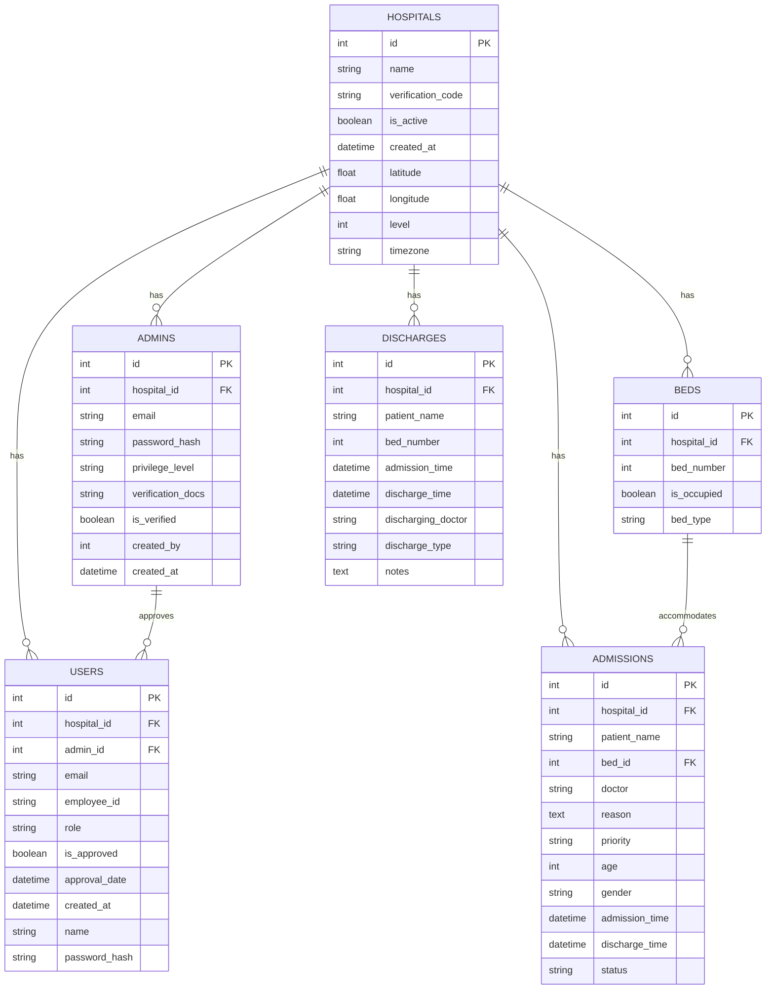
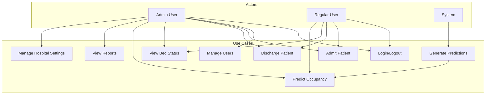
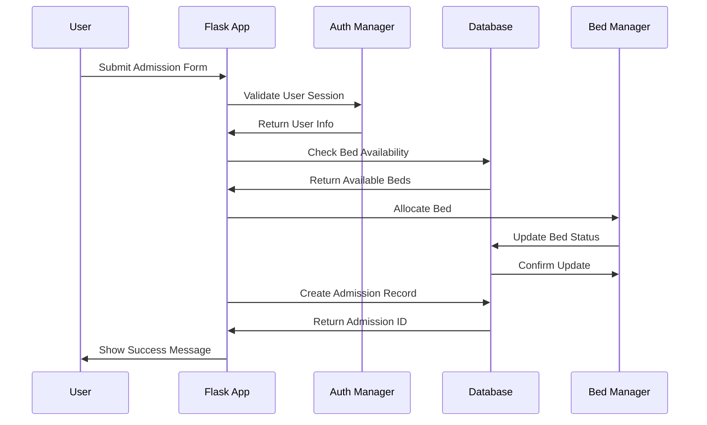
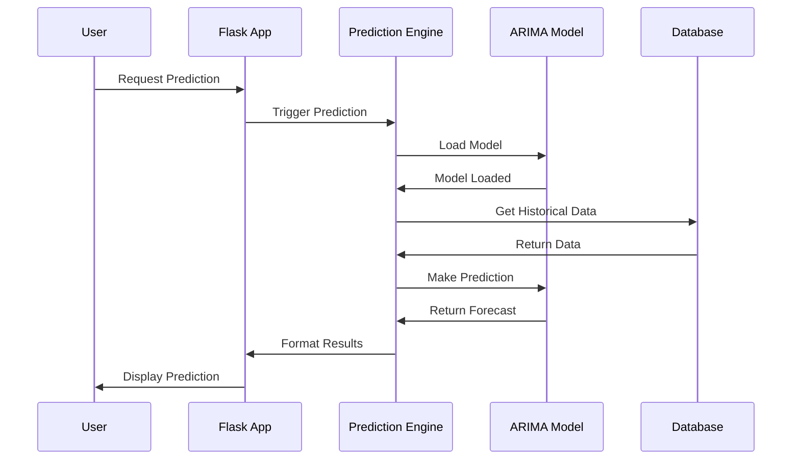
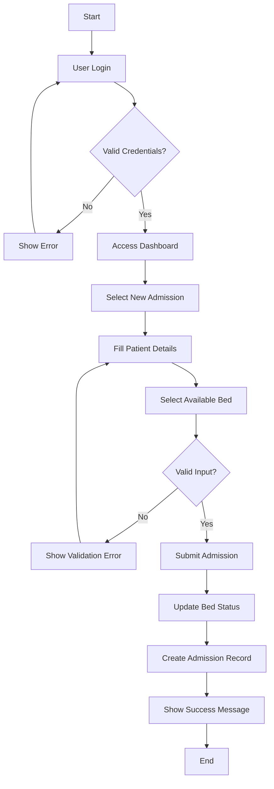
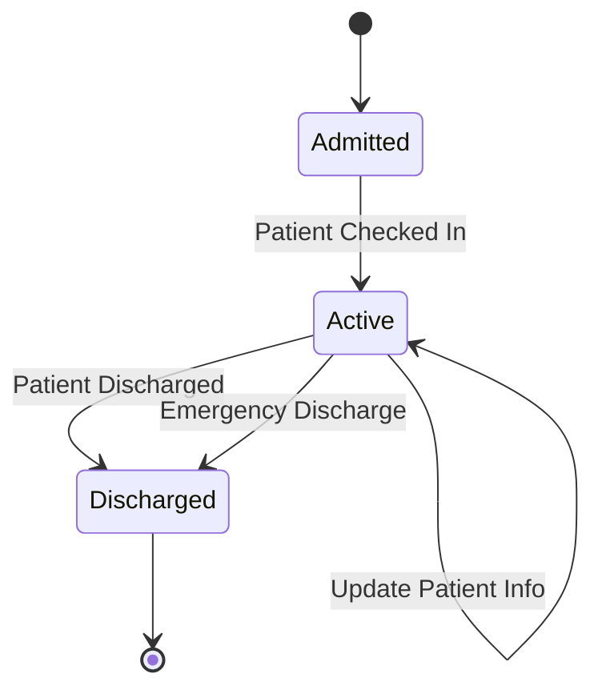
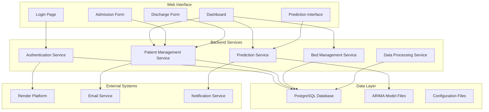
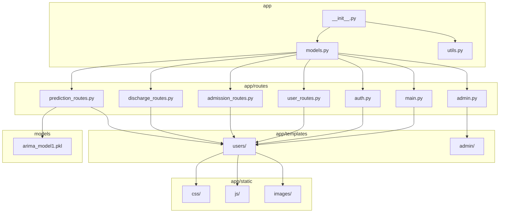
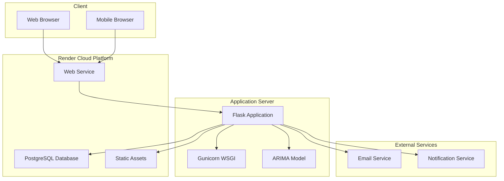

# UML Diagrams - ICU Occupancy Prediction System

## 1. Class Diagram

```mermaid
classDiagram
    class UserMixin {
        <<interface>>
        +get_id() String
        +is_authenticated Boolean
        +is_active Boolean
        +is_anonymous Boolean
    }

    class Hospital {
        +id: Integer
        +name: String
        +verification_code: String
        +is_active: Boolean
        +created_at: DateTime
        +latitude: Float
        +longitude: Float
        +level: Integer
        +timezone: String
        +get_timezone() Timezone
        +total_beds: Integer
        +available_beds: Integer
    }

    class Admin {
        +id: Integer
        +hospital_id: Integer
        +email: String
        +password_hash: String
        +privilege_level: String
        +verification_docs: String
        +is_verified: Boolean
        +created_by: Integer
        +created_at: DateTime
        +set_password(password: String)
        +check_password(password: String): Boolean
        +get_id(): String
    }

    class User {
        +id: Integer
        +hospital_id: Integer
        +admin_id: Integer
        +email: String
        +employee_id: String
        +role: String
        +is_approved: Boolean
        +approval_date: DateTime
        +created_at: DateTime
        +name: String
        +password_hash: String
        +set_password(password: String)
        +check_password(password: String): Boolean
        +get_id(): String
        +get_type(): String
        +get_hospital(): Hospital
    }

    class Bed {
        +id: Integer
        +hospital_id: Integer
        +bed_number: Integer
        +is_occupied: Boolean
        +bed_type: String
        +__repr__(): String
    }

    class Admission {
        +id: Integer
        +hospital_id: Integer
        +patient_name: String
        +bed_id: Integer
        +doctor: String
        +reason: Text
        +priority: String
        +age: Integer
        +gender: String
        +admission_time: DateTime
        +discharge_time: DateTime
        +status: String
        +local_admission_time: DateTime
        +local_discharge_time: DateTime
        +masked_patient_name: String
        +patient_initials: String
        +length_of_stay: Float
    }

    class Discharge {
        +id: Integer
        +hospital_id: Integer
        +patient_name: String
        +bed_number: Integer
        +admission_time: DateTime
        +discharge_time: DateTime
        +discharging_doctor: String
        +discharge_type: String
        +notes: Text
        +local_admission_time: DateTime
        +local_discharge_time: DateTime
        +patient_initials: String
        +length_of_stay: Integer
    }

    class ARIMAModel {
        +model_file: String
        +order: Tuple
        +load_model()
        +predict(weeks_ahead: Integer): Array
        +save_model()
    }

    class PredictionEngine {
        +arima_model: ARIMAModel
        +load_model()
        +make_prediction(weeks_ahead: Integer): Dict
        +validate_input(data: Dict): Boolean
    }

    %% Relationships
    UserMixin <|-- Admin
    UserMixin <|-- User

    Hospital ||--o{ Admin : has
    Hospital ||--o{ User : has
    Hospital ||--o{ Bed : has
    Hospital ||--o{ Admission : has
    Hospital ||--o{ Discharge : has

    Admin ||--o{ User : approves

    Bed ||--o{ Admission : accommodates

    Admission ||--|| Discharge : becomes

    PredictionEngine --> ARIMAModel : uses
```

## 2. Database Entity Relationship Diagram



## 3. Use Case Diagram



## 4. Sequence Diagram - Patient Admission Process



## 5. Sequence Diagram - Occupancy Prediction Process



## 6. Activity Diagram - Patient Admission Workflow



## 7. State Diagram - Patient Status



## 8. Component Diagram



## 9. Package Diagram



## 10. Deployment Diagram


